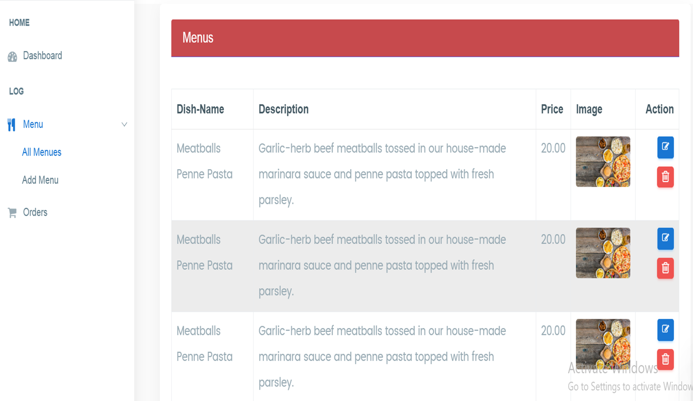

# **Restaurant Management System**

## **Overview**
The **Restaurant Management System** is a web-based platform designed to streamline restaurant operations and enhance the dining experience. Our solution offers tools for restaurant owners to manage menus, track orders, and handle payments while empowering customers to browse menus, place orders, and stay updated in real-time.

---

## **Features**

### **For Customers**
- **Browse Restaurants & Menus**: Explore restaurants and view detailed menus with categorized items.
- **Seamless Ordering**: Place orders effortlessly and track order status in real-time.
- **Favorites**: Save favorite orders for quick reordering.

### **For Restaurants**
- **Menu Management**: Add, update, and delete menu items with ease.
- **Order Management**: Track and manage customer orders efficiently.
- **Real-Time Notifications**: Stay informed about new orders and customer activity.

---

## **Installation**

### **Prerequisites**
- PHP >= 8.2
- Composer
- XAMP Or WAMP Server

### **Steps**
1. **Download project zip file**
2. **Extract project files and move them to server folder**
3. **Open cmd on project root folder**
4. **Install Dependencies**:
   ```bash
   composer install
   ```
5. **Run Migrations**:
   ```bash
   php artisan migrate --seed
   ```


4. **Start the Server**:
   ```bash
   php artisan serve
   ```

5. Access the application at [http://localhost:8000](http://localhost:8000).

---


---

## **Screenshots**

### **Homepage**

### **Menu Management**


### **Restaurants Search and Browsing**

### **Cart Management**


"# Online-Food-Ordring-System" 
